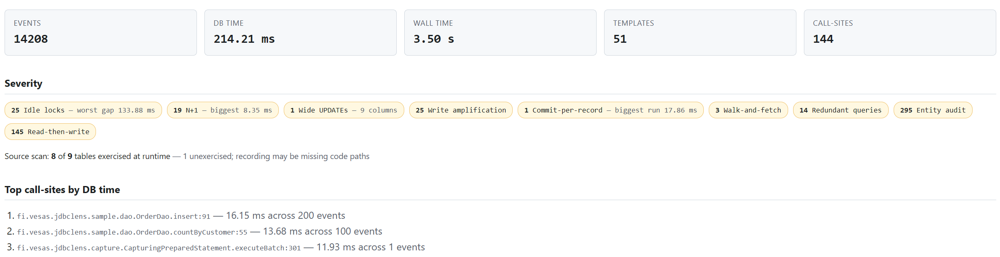
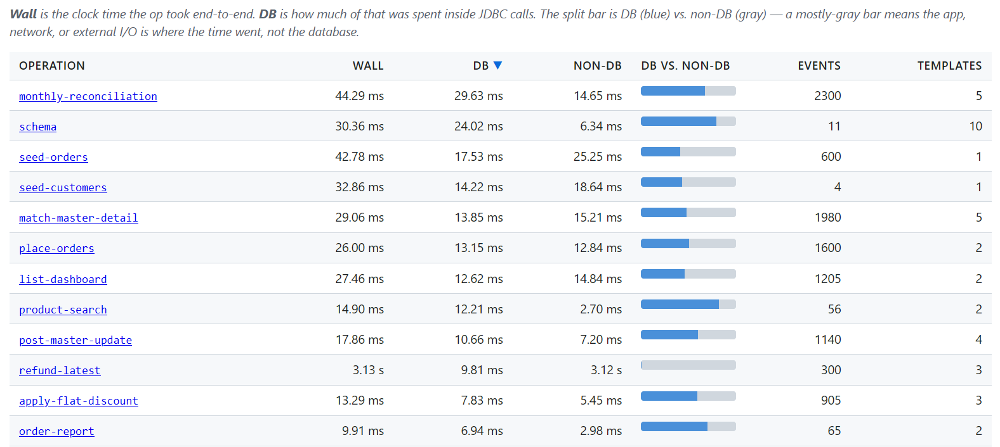

# JDBCLens

Find the line of code that's running 50 queries in a loop.
Records every JDBC query your app runs, attributes it to the call-site
in your code, and produces an HTML report. Results are grouped by
call-site, by SQL template, and by their combination. The call-site
view is what makes N+1 patterns and dominant call-sites easy to find.

See sample report → <a href="https://vesas.fi/jdbclens/report.html">View sample report</a>

## Screenshots





## Try it in 30 seconds

A bundled sample app talks to H2 and runs a classic N+1 loop under
the profiler:

```
./gradlew :sample-app:run
./gradlew :analysis:run --args="analyze sample-app/sample-recording.jdbclog -o sample-app/sample-report.html"
```

Open `sample-app/sample-report.html` in any browser. Look at
`Main.classicN1Loop:84` in the `(call-site, template) pairs` table —
that's the 50× repeated `SELECT name FROM customers WHERE id = ?`
the profiler flagged.

## Use it in another project

### 1. Add the dependency

**Gradle (Kotlin DSL):**
```kotlin
dependencies {
    testImplementation("fi.vesas.jdbclens:jdbc-lens-core:0.1.0")
}
```

**Gradle (Groovy DSL):**
```groovy
dependencies {
    testImplementation 'fi.vesas.jdbclens:jdbc-lens-core:0.1.0'
}
```

**Maven:**
```xml
<dependency>
    <groupId>fi.vesas.jdbclens</groupId>
    <artifactId>jdbc-lens-core</artifactId>
    <version>0.1.0</version>
    <scope>test</scope>
</dependency>
```

Use `implementation` / `compile` scope instead if you want the profiler active outside tests.

### 2. Start the profiler and wrap your DataSource

Before the workload you want to profile:

```java
import fi.vesas.jdbclens.Profiler;
import fi.vesas.jdbclens.ProfilerConfig;
import javax.sql.DataSource;
import java.nio.file.Path;

Profiler.start(ProfilerConfig.defaults(Path.of("recording.jdbclog")));
DataSource profiled = Profiler.wrap(yourRealDataSource);
// hand `profiled` to everything that talks to the database
```

`Profiler.wrap` may be called before or after `Profiler.start` —
wrapped DataSources resolve the session lazily, so they pass through
when no profiler is running and start capturing once `start()` fires.
The JVM shutdown hook calls `Profiler.stop()` automatically, or call
it yourself when the workload is done.

### 3. Run your tests / workload

Every query that flows through `profiled` is recorded to
`recording.jdbclog`.

### 4. Generate the report

From the `jdbc-lens` repo:

```
./gradlew :analysis:run --args="analyze /path/to/recording.jdbclog -o report.html"
```

Open `report.html` in any browser. The file is self-contained — no
network calls, no external CSS or JS.

## What you get

- Event count, total database time, wall time.
- Top call-sites by time.
- N+1 detection: call-sites that issue the same query repeatedly within
  a single logical operation are flagged.
- Sortable tables: `(call-site, template)` pairs, call-sites alone,
  templates alone.

## JSON output

Pass `--format json` to get machine-readable results instead of HTML:

```
./gradlew :analysis:run --args="analyze recording.jdbclog --format json"
```

Every finding includes its SQL template, execution count, total duration in
nanoseconds, and the call-site as structured data (class, method, line number).
Findings are sorted by severity — HIGH first, then MEDIUM, then LOW.

```json
{
  "schemaVersion": 1,
  "summary": { "totalEvents": 3200, "findingCounts": { "n1": 2 } },
  "findings": [
    {
      "type": "n1",
      "severity": "HIGH",
      "sql": "SELECT name FROM customers WHERE id = ?",
      "count": 150,
      "totalDurationNanos": 4500000,
      "callSite": {
        "className": "com.example.OrderService",
        "methodName": "loadAll",
        "lineNumber": 84
      }
    }
  ],
  "topCallSites": [...],
  "topTemplates": [...]
}
```

If source files are accessible, each call-site also includes a `sourceSnippet`
block with the 8 lines of code surrounding the problem. Source roots are inferred
from the classpath captured in the recording; you can set them explicitly with
`--source-root src/main/java`.

## Requirements

- Java 21+
- Gradle 8+ (the included `./gradlew` wrapper handles this automatically)
